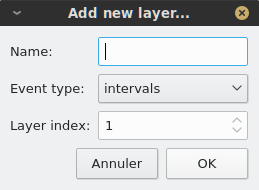

.. _sound_annot:

Sound annotation
================

This page explains how to work with **annotation views**, which are used to create, display and edit sound annotations. Annotation views share most of their features with **sound views**, and 
we recommend that you first get familiar with how sound views work (see :ref:`sound-view`) before reading this page. 

Opening annotation views
------------------------

Phonometrica currently supports two annotation formats: its own XML-based native format and Praat's TextGrid format. If you already have an annotation in
one of these formats in your current project, you can open it by double-clicking on it or right-right clicking on it and choosing
``View file``. This will open a new annotation view in the viewer.

Note that to be able to view (or edit) an annotation, it must first be bound to a sound file. To do this, you can either select the annotation and the
sound you want to bind in the file manager, right-click on any of them, and choose ``Bind annotation to sound file``, or you can click on the annotation
in the file manager and click on the ``Bind...`` button in the information panel. Note that although you can have several annotations bound to the same
sound file, each annotation can be bound to one sound file at most.

Creating a new annotation
-------------------------

Phonometrica offers a complete environment for speech annotation, which allows you to create new annotations and edit existing ones.

Creating layers and events
~~~~~~~~~~~~~~~~~~~~~~~~~~

To create a new annotation, you must first import the sound you want to annotate into the current project, for example using the command ``File > Add file(s) to project...``.
Next, right-click on the sound file and choose ``Create annotation``: this will open a new annotation view in the viewer. Since your annotation is empty, the view will look similar to
a sound view, but it will contain a few additional buttons dedicated to sound annotation in its toolbar.

The first thing we need to do is to add one or more annotation **layers**. Each layer stores a specific type of speech **event**, and is relatively independent from the other layers
in the annotation. There are two type of events: **intervals** are used to identify a portion of the sound file, and have a start time and an end time (and hence a duration); *instants*
are used to stamp a specific point in the sound file. Intervals and instants cannot be mixed on a given layer: therefore, when you create a new layer, you need to decide whether it 
will store intervals or instants. You can create a new layer using the ``Add new layer...`` command from the layer menu |layer|. A new dialog will appear and will ask you the layer's
name (you can leave it empty), the layer's type (intervals vs instants) and the layer's index (by default, it will be added after all existing layers, if any).

Once the layer is created, it will appear below the sound plots. If it is an instant layer, it will be empty; otherwise, it will contain one interval spanning from the beginning to 
the end of the file. Whatever type of layer you created, you can create new events by adding **anchors**, which are time stamps in the sound file. Phonometrica's data model is based 
on **annotation graphs** [BIR2001]_, so annotations are represented as a single graph: time points (i.e. anchors) represent nodes in the graph, and events represent labeled arcs
between these nodes. This means that an event always "knows" whether it shares an anchor with another event on an another layer: this makes it easy to represent hierarchical 
structures (e.g. words that contain syllables that contain segments) and alignment (e.g. words that are aligned with their part of speech).

To create one or more anchor(s), click on the ``Add anchor`` button |anchor|. You can then move your cursor anywhere in the layer you want to annotate and a moving anchor will follow
the mouse cursor: every time you click on the left button, a new anchor will be added where you click. Once you have added all the anchors you wanted to add, click again on the ``Add
anchor`` button. To remove one or more anchor(s), click on the ``Remove anchor`` button |remove|, click on the anchors you want to delete to remove them, and click again on the ``Remove 
anchor`` button to let Phonometrica that you have finished editing anchors.

By default, if you have more than one layer of the same type (i.e. two or more instant layers or two or more interval layers), Phonometrica will add (or remove) an anchor on all the 
instant layers if you added (or removed) an anchor on an instant layer, and on all the interval layers if you added (or removed) an anchor on an interval layer. This is because 
anchors are shared across layers. If you prefer to edit anchors on a single layer at a time, click on the ``Share/unshare anchors`` button |share|. The icon will become a broken
link |unshare|, which indicates that layers no longer share anchors. You can switch back and forth between the two modes (sharing and unsharing) at will, according to your needs.
Note that when anchors are not shared, you can still share new anchors across layers: whenever you add an anchor on a layer, a dotted gray line will be projected on the other layers. 
If you click on any of these temporary anchors, it will be changed to a permanent anchor. This allows you to have more control over which layers share which anchors.

Finally, you can move any anchor by clicking on it and dragging it with the mouse to the desired position. If anchors are shared, the anchor will be moved on all layers (of the same 
type) that share this anchor. If anchors are not shared, the anchor will be moved on a single layer at a time.

Labelling events
~~~~~~~~~~~~~~~~

Once you have created events on one or more layers, you will most likely want to label them. To do this, you can simply double-click on the event you want to edit: this will open 
a small dialog where you can input the event's label. Once you are done editing the label, press the ``Enter`` key to validate the label. You can cancel the editing by clicking on
the ``Esc`` key.

Instead of using the mouse, you can edit events using the keyboard. First click on any event to give it focus. Once an event is focused, you can use the keyboard the arrows to navigate 
in the annotation. The Up and Down arrows allow you to move to the previous and next layer, respectively, whereas the Left and Right arrows allow you to move to the previous and next 
layer within a single layer. Once you have focused the event you want to edit, simply press ``Enter`` to open the event editor and press ``Enter`` again to validate or ``Esc`` to 
cancel the editing. 

If you are repeatedly editing events on a given layer and you are not satisfied with the event editor's position, you can move it up or down. Phonometrica will remember its vertical
position for each layer and will place it at the same vertical position the next time you edit an event on this layer. This allows you, for example, to make sure that the pitch track
is always visible if your annotating prosody. 

Managing layers
~~~~~~~~~~~~~~~

The layer menu |layer| offers a number of options to manage layers. You can click on any layer and choose the appropriate command to rename, remove, duplicate or clear the content 
of a layer. In addition, the ``Select visible layers`` command allows you to selectively show and hide layers. This is particularly useful when you have many layers and you would 
like to focus on a specific subset.

Saving annotations
~~~~~~~~~~~~~~~~~~

To save an annotation, simply click on the ``Save annotation`` button |save| in the toolbar. The annotation will be saved to Phonometrica's own native format (with a ``.phon-annot`` extension).
This format is based on the XML standard and uses the UTF-8 encoding: as a result, it can be opened in any text editor and can be easily processed by any XML-compliant piece of software.

In addition to the annotation graph itself, a native annotation file contains all the metadata associated with the file (properties, description, sound file). Therefore, you can easily share or move these files without
losing any information.

Importing and exporting annotations
~~~~~~~~~~~~~~~~~~~~~~~~~~~~~~~~~~~

In addition to its own native annotation format (``.phon-annot`` extension), Phonometrica allows you seemlessly work with annotations in the widely used TextGrid format (``.TextGrid`` extension),
which is produced by the `Praat <http://www.praat.org>`_ program. Phonometrica can read TextGrid file s encoded in UTF-8 or UTF-16 and can write them
(currently, in UTF-8 only).

To convert an a native Phonometrica annotation to a TextGrid, right-click on it in the file manager and choose ``Save as Praat TextGrid...``. Likewise,
to convert a TextGrid to a Phonometrica annotation, right-click on it and choose ``Save as Phonometrica annotation...``. Both commands will give you
the opportunity to import the file into the current project.

TextGrid files can be visualized and edited like native annotations, but please note that due to the limitations of the TextGrid format, metadata will
*not* be stored in the TextGrid file. Instead, they will be stored in a database associated with your project, which is stored in your Phonometrica
directory in your user directory.

References
----------

.. [BIR2001] Bird, Steven & Mark Liberman. 2001. A Formal Framework for Linguistic Annotation. *Speech Communication* 33(1–2). 23–60.

    

    
.. |save| image:: ../icons/save.png
    :height: 16px
    :width: 16px