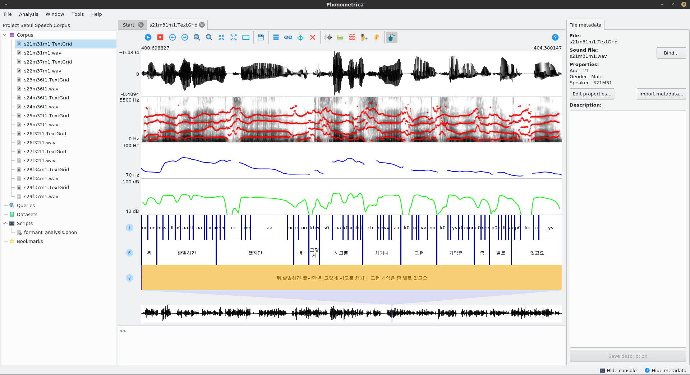

.. Phonometrica documentation master file, created by
   sphinx-quickstart on Sun Apr  8 05:51:44 2018.
   You can adapt this file completely to your liking, but it should at least
   contain the root `toctree` directive.

   
============
Phonometrica
============

Overview
========

Phonometrica is a free, open-source software platform for the annotation and analysis of speech corpora.
It offers a user-friendly interface to manage, annotate and query language corpora.
It is particularly well suited for dealing with time-aligned data. The main features it offers are:

   * Project management: organize files into projects.
   * Sound visualization and annotation: visualize and annotate speech sounds on multiple layers
   * Extensible metadata: annotate files with properties, which allow you to sort and organize your corpus.
   * Queries: build and save simple or complex queries; search strings or patterns across layers.
   * Scripting engine: Phonometrica can be configured and extended with an easy-to-use scripting language and JSON files.
   * Standard-based: Phonometrica files are encoded in XML and Unicode.
   * Interaction with Praat: Phonometrica can read and write TextGrid files and open files directly in Praat.

Phonometrica runs on all major platforms (Windows, macOS and GNU/Linux) and is freely available under the terms of the CECILL license (version 2.1).
The latest version can be downloaded from http://www.phonometrica-ling.org. If you encounter any problem or bug, please write to the authors.

**Note: Phonometrica is currently under development: the documentation is still incomplete and some things might change before version 1.0 is released.**

Download
========

Phonometrica 0.5.1 (preview)
----------------------------

-  Windows 7 and later:
   `setup\_phonometrica.exe <https://github.com/phonometrica/phonometrica/releases/download/v0.5.1/setup_phonometrica.exe>`__
-  MacOS 10.7 and later:
   `phonometrica.dmg <https://github.com/phonometrica/phonometrica/releases/download/v0.5.1/phonometrica.dmg>`__
-  Linux (Debian 10 / Ubuntu 18.04): `phonometrica-0.5.1.deb <https://github.com/phonometrica/phonometrica/releases/download/v0.5.1/phonometrica-0.5.1.deb>`__
-  source code: available on `GitHub <https://github.com/phonometrica/phonometrica>`__

	misc 	v0.5.1 	4 hours ago
	phon 	right-align left context in query view 	2 hours ago
	plugins/PFC 	version 0.4.0 	10 days ago
	std 	export metadata 	2 days ago
	unit_test 	fixes for Windows 	last month
	.gitignore 	import sources 	last month
	CMakeLists.txt 	static PCRE2 on Windows 	3 hours ago
	CMakeSettings.json 	import sources 	last month
  
Manual
------

Phonometrica's documentation is available as a `PDF <https://github.com/phonometrica/phonometrica/releases/download/v0.5.1/phonometrica_manual.pdf>`_ file.

Topics
======

.. toctree::
   :maxdepth: 1
	
   intro/install
   intro/start
   annotation
   query
   scripting/index
   scripting/plugins
   License <about/license>
   about/acknowledgements
   about/release-notes

How to cite?
============

To cite Phonometrica, you can use the following citation:

.. [EYC2019] Eychenne, Julien & Léa Courdès-Murphy (2019). Phonometrica: an open-source platform for phonometrics [Computer program]. Version |release|, retrieved |today| from http://www.phonometrica-ling.org

