.. _page-user-dialogs:

User dialogs
============

Phonometrica allows you to create custom dialogs that you can integrate into your scripts.
These can be used to obtain some input from users of your scripts. 
User dialogs are created with the ``create_dialog()`` function, which takes as input a 
JSON object describing the user dialog, and returns a JSON object containing the user's
choices, if any. 

Creating a dialog
-----------------

We will start with a minimalist dialog that only displays some text. A dialog must have at 
least two attributes: a ``title``, which corresponds to the title of the window, and an array
of ``items``, which may be empty. Each item is a JSON object: its ``type`` attribute indicates
which type of user interface component the object represents, and the other attributes 
depend on the type of component (see below). Here, we are simply displaying a label with a
``text`` attribute. 

.. code:: json

    {
        "title": "My first dialog",
        "items": [
            { "type": "label", "text": "My first label" }
        ]
    }

There are several optional attributes that can be used to customize our dialog. ``width``
and ``height`` allow you to set the *minimum* width and height of the dialog, whereas 
``yes_no`` can be set to ``true`` to use ``Yes/No`` buttons instead of the default ``OK/Cancel``.

.. code:: json

    {
        "title": "My first dialog",
        "width": 300,
        "height": 200,
        "yes_no": true,
        "items": [
            { "type": "label", "text": "My first label" }
        ]
    }

Once we have created a JSON object describing our dialog's user interface, we can pass it 
to the ``create_dialog()`` function.

.. code:: phon

    var ui = {
        "title": "My first dialog",
        "width": 300,
        "height": 100,
        "yes_no": true,
        "items": [
            { "type": "label", "text": "My first label" }
        ]
    }

    create_dialog(ui)

The resulting dialog will look something like that:

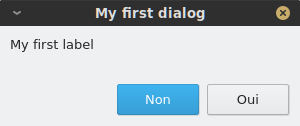

If the user presses ``OK`` (or ``Yes`` if ``yes_no`` is ``true``), ``create_dialog()`` will return a JSON object containing the user's input (which will be empty
in this case); if the user presses ``Cancel`` (or ``No``), it will return the value ``null``.

User interface components
-------------------------

Each user interface component has its own attributes, but there are a few important commonalities. Components which accept some user input have a ``name``
attribute: this will be used as a key in the JSON object returned by ``create_dialog()`` to retrieve the corresponding value. In addition, components that 
accept a default value have an optional ``default`` attribute that allows you to explicitly set a default value.

Label
~~~~~

A **label** must have its ``type`` attribute set to ``label``. A label has one additional required attribute, `text`, which corresponds to the text that
is displayed inside the label.

.. code:: json

    { "type": "label": "text": "This is a label" }

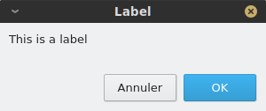

Button
~~~~~~

A **button** must have its ``type`` attribute set to ``button``. Whenever the button is pressed, the associated **action** is triggered. You must specify 
a ``label`` attribute, which is the text that will appear on the button, and an ``action`` attribute which can be any valid string of Phonometrica code.
By default, unless the button is stored in a container, it will fill the whole width of the dialog. You can use the optional ``position`` attribute to 
make it smaller and control its position. Valid values are ``left``, ``center`` and ``right``. If the button is inside of a container, the ``position`` attribute
is ignored. 

.. code:: json

        { "type": "button", "label": "test", "action": "print('button clicked!')", "position": "left" }    

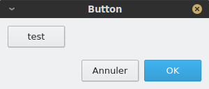

File selector
~~~~~~~~~~~~~

A **file selector** must have its ``type`` attribute set to ``file_selector``. A file selector combines a ``Choose...`` button, which lets the user select 
a file (which may or may not exist) and a field which displays the file's path.  You must specify a ``name`` attribute, which is the key that will be used in the result object to retrieve the file selector's value, and a ``title`` which will 
be displayed in the file selection dialog that opens when the user presses the ``Choose...`` button. You can specify a 
``default`` attribute (as a string): If no default value is provided, the file selector's field will be empty. Additionally, you can specify a ``filter`` attribute
that will be used to restrict the type of files that can be selected. For example, The filter ``"CSV (*.txt *.csv *.tsv)"`` would accept 
all CSV files (comma-separated value) that have ``.txt``, ``.csv`` or ``.tsv`` extension.

.. code:: json

    { "type": "file_selector", "name": "path", "title": "Select text file...", "default": "output.txt", "filter": "CSV (*.txt *.csv *.tsv)" }

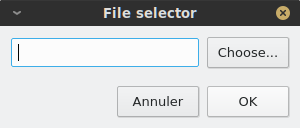

Field
~~~~~

A **field** must have its ``type`` attribute set to ``field``. A field can be used to input a line of text.  
You must specify a ``name`` attribute, which is the key that will be used in the result object to retrieve the field's value. Additionally,
you may specify a ``default`` value. 

.. code:: json

    { "type": "field", "name": "field1", "default": "some default text" }

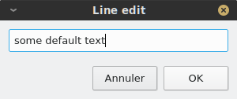

Check box
~~~~~~~~~

A **check box** must have its ``type`` attribute set to ``check_box``. It lets you retrieve a Boolean value from the user: when the check box is checked,
the value ``true`` is returned, whereas ``false`` is returned if the box is unchecked. You must specify a ``name`` attribute, which is the key that will 
be used in the result object to retrieve the check box's value, and a ``text`` attribute which is the text that will be displayed next to the check box. 
In addition, you may specify a ``default`` value, which must be ``Boolean``.

.. code:: json

		{ "type": "check_box", "name": "overwrite", "text": "Overwrite file if it exists", "default": true }

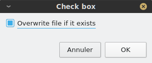

Check list
~~~~~~~~~~

A **check list** must have its ``type`` attribute set to `check_list``. It is used to display a list of values that can be checked. You must specify a 
``name`` attribute, which is the key that will be used in the result object to retrieve the check list's values. You must also provide a list of ``values``
as a JSON array of strings: all checked values will be stored in the return value (again, as a JSON array of strings). In addition to the list of values, 
you may specify a list of ``labels``: in this case, labels will be displayed instead of values and values will be shown as tool tips when the user hovers 
their mouse over the label. This feature can be used to display shorter values than those we actually want to store. 

.. code:: json

    { "type": "check_list", "name": "annotations",
      "labels": [ "nzdajm1vg.TextGrid", "nzdajm1cg.TextGrid", "nzdajm1fg.TextGrid","nzdajm1tg.TextGrid" ],
      "values": [
         "/home/julien/PAC/JM/nzdajm1vg.TextGrid",
         "/home/julien/PAC/JM/nzdajm1cg.TextGrid",
         "/home/julien/PAC/JM/nzdajm1fg.TextGrid",
         "/home/julien/PAC/JM/nzdajm1tg.TextGrid",
      ]
    }

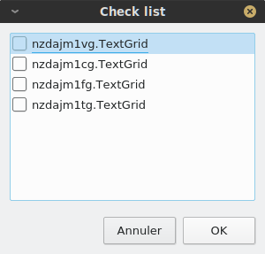

Radio buttons
~~~~~~~~~~~~~

A group of **radio buttons** must have its ``type`` attribute set to ``radio_buttons``. It is used to display a number of exclusive options, where only one
can be selected at a time. You must specify a ``name`` attribute, which is the key that will be used in the result object to retrieve the index of the 
selected value. You must also provide a list of ``values`` as a JSON array of strings. The index of the default value can be specified with the ``default``
attribute, which must be an integer. Finally, you can add a ``title`` attribute to provide a label for the button group. 

.. code:: json

    { "type": "radio_buttons", "name": "tough_choice", "values": [ "blue pill", "red pill" ], "title": "Tough choice", "default": 1 }

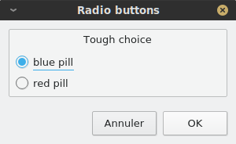

Combo box
~~~~~~~~~

A **combo box** is conceptually similar to a group of radio buttons in that it allows you to select one among several options. The choices are displayed as a list,
instead of a group of buttons. A combo box must have its ``type`` attribute set to ``combo_box``. You must specify a ``name`` attribute, which is the key that will be used in the result object to retrieve the index of the 
selected value. You must also provide a list of ``values`` as a JSON array of strings. The index of the default value can be specified with the ``default``
attribute, which must be an integer. 

.. code:: json

    { "type": "combo_box", "name": "tough_choice", "values": [ "blue pill", "red pill" ], "default": 2 }

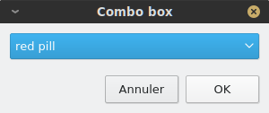

Container
~~~~~~~~~

A **container** must have its ``type`` attribute set to ``containter``. A container is not a visible component, but is used to pack components together 
horizontally (by default) or vertically. A container must have an ``items`` attribute, which is an array of components. You can use the ``orientation`` 
attribute to control the container's packing policy. It accepts two values: ``horizontal`` or ``vertical``.

.. code:: json

    { "type": "container", "items": [
        { "type": "button", "label": "button 1", "action": "info('A useless button!')", "position": "left" },
        { "type": "button", "label": "button 2", "action": "info('Another useless button!')", "position": "left" }
    ]}    
    

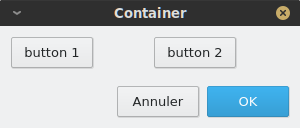

Stretch
~~~~~~~

A **stretch** must have its ``type`` attribute set to ``containter``. It is a special component that can be put inside a container to fill unused space.
It has no attribute beside its type.

.. code:: json

    { "type": "container", "items": [
        { "type": "button", "label": "button 1", "action": "info('A useless button!')", "position": "left" },
        { "type": "button", "label": "button 2", "action": "info('Another useless button!')", "position": "left" },
        { "type": "stretch" } 
    ]}    

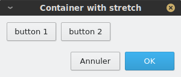

Spacing
~~~~~~~

A **spacing** must have its ``type`` attribute set to ``spacing``. It is a special component that can be put inside a container to separate components.
You must specify its ``size`` attribute, which is an integer that represents the size of the spacing (in pixels).

.. code:: json

    { "type": "container", "items": [
        { "type": "button", "label": "button 1", "action": "info('A useless button!')", "position": "left" },
        { "type": "spacing", "size": 20 },
        { "type": "button", "label": "button 2", "action": "info('Another useless button!')", "position": "left" },
        { "type": "stretch" } 
    ]}    

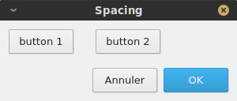